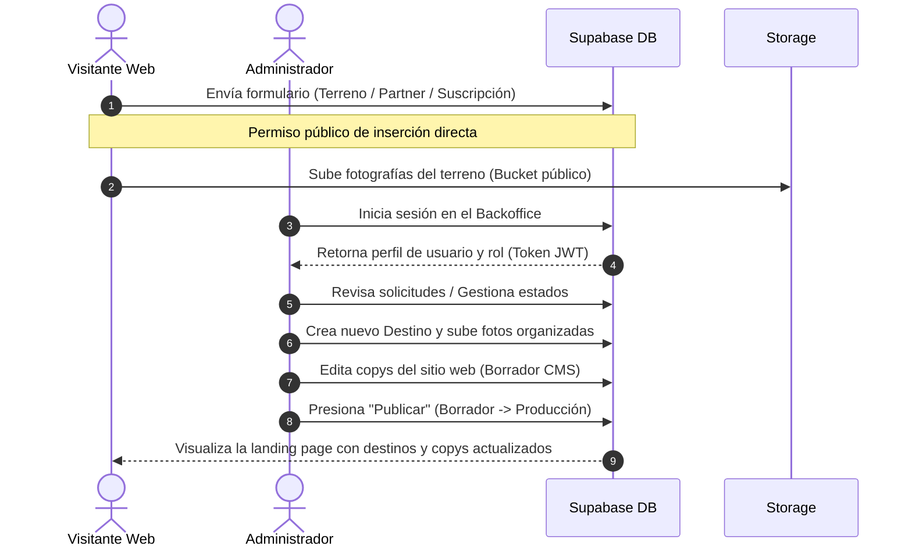

# NÓMADE — Red de Hospitalidad y Bienestar

Plataforma digital integrada para la gestión de la red de hospitalidad y bienestar de **NÓMADE**. Este repositorio unifica la landing page pública y el panel de administración interna (Backoffice) en una única solución moderna, mantenible y escalable.

---

## Índice

1. [Descripción General](#descripción-general)
2. [Características Principales](#características-principales)
3. [Estructura del Proyecto](#estructura-del-proyecto)
4. [Stack Tecnológico](#stack-tecnológico)
5. [Arquitectura y Patrones](#arquitectura-y-patrones)
6. [Configuración e Instalación](#configuración-e-instalación)
7. [Base de Datos y Esquema SQL](#base-de-datos-y-esquema-sql)
8. [Seguridad y Control de Accesos](#seguridad-y-control-de-accesos)
9. [Flujo General de Datos](#flujo-general-de-datos)
10. [Despliegue](#despliegue)
11. [Buenas Prácticas Implementadas](#buenas-prácticas-implementadas)
12. [Licencia](#licencia)

---

## Descripción General

**NÓMADE** es una plataforma diseñada para conectar a propietarios de tierras de alto valor paisajístico, establecimientos de hospitalidad y futuros huéspedes interesados en experiencias de alojamiento lento y bienestar en entornos naturales. 

El sistema resuelve dos necesidades críticas del negocio:
1. **Superficie Pública (Landing Page)**: Captación de interesados, postulación de terrenos, suscripción a listas de espera y exposición de los destinos turísticos habilitados en la red.
2. **Superficie Privada (Backoffice Administrativo)**: Gestión del ciclo de vida de los datos recibidos, evaluación operativa y legal de candidatos, analíticas de tráfico de huéspedes, administración de accesos del personal y edición en tiempo real de contenidos web (CMS).

---

## Características Principales

### 1. Landing Page Pública (`/`)
- Presentación de la propuesta de valor y visión de marca.
- Exposición dinámica de **Destinos** disponibles para reservar.
- Formulario interactivo de postulación de terrenos para propietarios.
- Formulario de suscripción a la lista de espera de huéspedes.
- Formulario para establecimiento de alianzas con operadores turísticos (Partners).

### 2. Panel Administrativo (`/panel`)
- **Dashboard**: Consola centralizada con estadísticas en tiempo real y alertas rojas de registros pendientes de revisión.
- **Postulaciones**: Ficha interactiva de evaluación técnica, geográfica, legal y visual del terreno postulado. Incluye un sistema de pestañas detalladas, carga de notas internas y control de estados del trámite.
- **Partners**: Control y seguimiento de establecimientos interesados, segmentados por rubro comercial (glamping, viñedo, camping, etc.).
- **Lista de Huéspedes y Métricas**: Listado de espera interactivo junto con un panel analítico detallado con gráficos de barra segmentados por procedencia geográfica y dispositivo de acceso.
- **Destinos (ABM)**: Módulo de alta, edición y baja (archivo/eliminación) de destinos en la red. Cuenta con un gestor interactivo de orden de fotografías y un interruptor de visibilidad pública inmediata.
- **Contenido del Sitio (CMS)**: Gestor de contenidos visual y de textos organizados en acordeones. Cuenta con sincronización automática de scroll y un simulador en tiempo real de la landing page.
- **Ajustes**: Panel de administración de cuentas de usuario del personal del backoffice (exclusivo del Administrador).
- **Mi Cuenta**: Modal transversal para el cambio seguro de contraseñas de acceso.

---

## Estructura del Proyecto

El proyecto está estructurado siguiendo las convenciones de Next.js (App Router) y la separación de responsabilidades:

```text
nomade-app/
├── public/                     # Recursos públicos estáticos (imágenes, logos de marca)
│   └── assets/
│       ├── brand/              # Isotipo y logotipos vectoriales de NÓMADE
│       └── photos/             # Imágenes locales de muestra
├── src/
│   ├── app/                    # Enrutamiento de Next.js (App Router)
│   │   ├── api/                # API Routes auxiliares
│   │   ├── panel/              # Rutas del Backoffice (Ajustes, CMS, Destinos, etc.)
│   │   ├── layout.jsx          # Layout global de la aplicación
│   │   └── page.jsx            # Página principal (Landing Page pública)
│   ├── assets/                 # Recursos importados en componentes
│   ├── components/             # Componentes modulares y reutilizables
│   │   ├── landing/            # Secciones y componentes de la landing pública
│   │   └── panel/              # Componentes, tablas, modales y layouts del Backoffice
│   ├── data/                   # Archivos de datos estáticos y copys del sitio
│   ├── lib/                    # Librerías de configuración e inicializadores
│   │   ├── supabase/           # Cliente de Supabase y esquema SQL
│   │   ├── auth.js             # Módulo de sesión y autenticación
│   │   └── store.js            # Base de datos en LocalStorage (sistema fallback)
│   ├── repositories/           # Abstracción de acceso a datos (Patrón Repository)
│   │   ├── applications/       # Repositorio de Postulaciones
│   │   ├── contenido/          # Repositorio del CMS
│   │   ├── destinations/       # Repositorio de Destinos
│   │   ├── huespedes/          # Repositorio de Lista de Espera de Huéspedes
│   │   ├── partners/           # Repositorio de Establecimientos Partners
│   │   └── users/              # Repositorio de Gestión de Usuarios del Backoffice
│   └── styles/                 # Hojas de estilo estructuradas
│       ├── tokens.css          # Design system tokens (colores, fuentes, sombras)
│       ├── landing.css         # Estilos específicos de la landing
│       └── panel.css           # Estilos de la interfaz de administración
├── next.config.js              # Configuración oficial de Next.js
├── tsconfig.json               # Configuración de compilación TypeScript
├── vercel.json                 # Reglas de despliegue para hosting
└── package.json                # Configuración del proyecto y dependencias
```

---

## Stack Tecnológico

El proyecto está construido sobre un stack moderno y eficiente enfocado en alto rendimiento y escalabilidad:

- **Frontend Core**: [Next.js 14](https://nextjs.org/) (React Framework con App Router).
- **Librería de UI**: [React 18](https://react.dev/).
- **Base de Datos**: [PostgreSQL](https://www.postgresql.org/) alojado en [Supabase](https://supabase.com/).
- **Autenticación**: [Supabase Auth](https://supabase.com/docs/guides/auth) (Módulo de autenticación gestionado).
- **Almacenamiento (Storage)**: [Supabase Storage](https://supabase.com/docs/guides/storage) para la subida de fotografías de postulaciones y destinos.
- **Estilos**: Hojas de estilo CSS nativas y modularizadas, estructuradas bajo un sistema de variables semánticas (Design Tokens).
- **Librería de Iconos**: [Lucide React](https://lucide.dev/).
- **Lenguaje**: JavaScript (ES6+) y TypeScript para definición de interfaces en repositorios.

---

## Arquitectura y Patrones

### Híbrido de Datos y Patrón Repository
Para desacoplar la interfaz gráfica de la base de datos física, el proyecto implementa el **Patrón Repository** en todos sus dominios. 

El sistema admite una arquitectura de persistencia híbrida determinada por la variable de entorno `NEXT_PUBLIC_DATA_SOURCE`:
- **Modo Supabase (`supabase`)**: Los repositorios realizan consultas y mutaciones directamente contra la base de datos PostgreSQL en Supabase.
- **Modo Local (`local` / fallback)**: Ideal para entornos sin conexión, pruebas locales o demostraciones rápidas. Las operaciones se realizan en la memoria del navegador (`localStorage`) inicializando un conjunto de datos ficticios (*seed*).

---

## Configuración e Instalación

### Requisitos Previos
- Node.js versión 18 o superior.
- Gestor de paquetes `npm`.

### 1. Clonado del Repositorio
```bash
git clone <URL_DEL_REPOSITORIO>
cd LandingNomade
```

### 2. Instalación de Dependencias
```bash
npm install
```

### 3. Configuración de Variables de Entorno
Crea un archivo `.env.local` en la raíz del proyecto y completa con las siguientes llaves según tu proveedor de Supabase:

```env
# URL de la API de Supabase
NEXT_PUBLIC_SUPABASE_URL=https://<tu-id-de-proyecto>.supabase.co

# Clave pública anónima de Supabase
NEXT_PUBLIC_SUPABASE_ANON_KEY=tu-anon-key-aqui

# Clave de rol de servicio (solo lectura y escritura sin bypass en RLS)
SUPABASE_SERVICE_ROLE_KEY=tu-service-role-key-aqui

# Origen de datos activo: 'supabase' para usar la nube, 'local' para simular en LocalStorage
NEXT_PUBLIC_DATA_SOURCE=supabase
```

### 4. Ejecución en Entorno de Desarrollo
```bash
npm run dev
```
Abre [http://localhost:3000](http://localhost:3000) en el navegador para ver la aplicación activa.

### 5. Construcción para Producción
```bash
npm run build
npm run start
```

---

## Base de Datos y Esquema SQL

La definición completa del esquema de base de datos se encuentra documentada en el archivo [schema.sql]. El sistema contiene las siguientes tablas y propósitos:

- **`profiles`**: Almacena los metadatos de los usuarios autorizados (nombre, correo, rol y estado de actividad). Mantiene una referencia uno a uno con la tabla interna de usuarios de Supabase Auth (`auth.users`).
- **`postulaciones`**: Registra los datos de los terrenos ingresados por los propietarios. Contiene campos estructurados de ubicación, tamaño, topografía, servicios, aspectos legales, fotos e historial de notas internas en formato JSONB.
- **`partners`**: Guarda los datos de contacto y detalles operativos de los establecimientos candidatos para alianzas comerciales.
- **`guest_waitlist`**: Controla el listado de espera de huéspedes, registrando datos de origen geográfico, sistema operativo y navegador para realizar analíticas de tráfico.
- **`destinos`**: Almacena las cabañas o experiencias habitacionales publicadas en la web.
- **`contenido`**: Almacena un registro de ID único (`landing`) que contiene dos objetos JSONB: `draft_content` (borrador de edición interna) y `published_content` (versión del sitio actualmente visible al público).

---

## Seguridad y Control de Accesos

La seguridad del sistema está construida a nivel de base de datos utilizando el sistema **Row Level Security (RLS)** de PostgreSQL en Supabase, y protegida en el frontend mediante enrutadores condicionales.

### Niveles de Acceso (Roles)
1. **Administrador (`admin`)**: Acceso total de lectura, edición y borrado a lo largo de toda la plataforma. Es el único perfil habilitado para entrar al módulo **Ajustes** y gestionar usuarios del backoffice.
2. **Usuario (`user`)**: Nivel de acceso operativo. Permite interactuar con los módulos de Postulaciones, Partners, Huéspedes, Destinos y CMS, pero bloquea el acceso a la gestión de cuentas y configuración global de Ajustes.

### Funciones de Seguridad en Base de Datos (PostgreSQL)
- **`is_admin()`**: Función que valida si el usuario logueado en Supabase posee un perfil activo de tipo `admin` en la tabla `profiles`.
- **`get_email_by_username()`**: Función para resolver el inicio de sesión. Permite al personal ingresar escribiendo su nombre de usuario en lugar del correo electrónico completo.

### Políticas RLS Aplicadas
- **Perfiles (`profiles`)**: 
  - Selección autorizada para cualquier usuario autenticado.
  - Inserción/Edición/Eliminación restringida únicamente a cuentas administradoras mediante la regla `public.is_admin()`.
- **Postulaciones, Partners y Lista de Huéspedes**:
  - Inserción abierta a usuarios no autenticados (`anon`) para que los formularios de la web pública funcionen libremente.
  - Acceso completo (CRUD) restringido únicamente a usuarios autenticados del sistema.
- **Destinos y Contenido CMS**:
  - Lectura pública abierta para renderizar la landing page.
  - Modificación de contenidos restringida a personal del panel autenticado.

---

## Flujo General de Datos

El flujo funcional de datos se desarrolla siguiendo la siguiente interacción:



---

## Despliegue

La aplicación se encuentra lista para ser desplegada en plataformas compatibles con Next.js y Supabase:

- **Frontend**: Alojado en [Vercel](https://vercel.com/) o Netlify. El archivo `vercel.json` ya incluye las reglas de reescritura para rutas SPA, aunque Next.js gestiona el enrutamiento híbrido de forma automática.
- **Backend / DB / Storage**: Alojados en la infraestructura en la nube de **Supabase**. Las variables de entorno son inyectadas en la consola de Vercel para evitar la exposición de credenciales en producción.

---

## Buenas Prácticas Implementadas

- **Clean Architecture**: Separación estricta de responsabilidades entre la capa de presentación (React), lógica de negocio (hooks/auth) y persistencia de datos (Repositories).
- **Separación de Capas**: Desacoplamiento de Supabase y LocalStorage mediante abstracciones de repositorio, facilitando la migración del motor de base de datos sin alterar los componentes visuales.
- **SOLID / Clean Code**: Componentes enfocados, nombres semánticos, reusabilidad de componentes UI y validaciones estrictas en formularios de edición.
- **Seguridad Robusta**: Control de roles y validación de usuarios tanto en frontend (Router Guards) como en backend (Reglas RLS a nivel de base de datos).

---

## Licencia

No se encontró una licencia formalizada en el repositorio. El uso de este código fuente está restringido a fines operativos internos de la marca **NÓMADE**.
